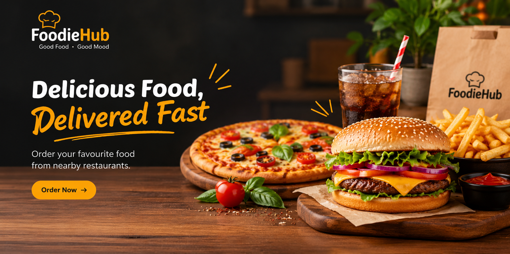

# 🍔 FoodieHub

FoodieHub is a food delivery website built from scratch using HTML5 and CSS3.

## 🚀 Features

- Responsive navigation bar
- Hero section with food delivery banner
- Food categories section
- Popular restaurants section
- Special offers section
- Footer with quick links and contact information
- Clean and simple user interface

## 🛠️ Technologies Used

- HTML5
- CSS3

## 📸 Screenshot

## 📌 About the Project

I built this project to practice and strengthen my HTML and CSS skills.
The website was created independently from scratch without copying a tutorial or ready-made project.

## 🔮 Future Improvements

- Make the website fully responsive
- Add JavaScript functionality
- Add interactive buttons and navigation
- Add more pages and features

---

**Made with ❤️ while learning Frontend Development.**
